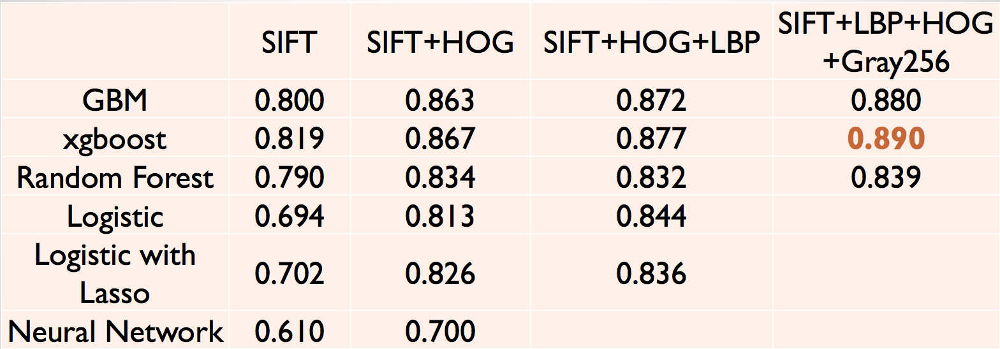
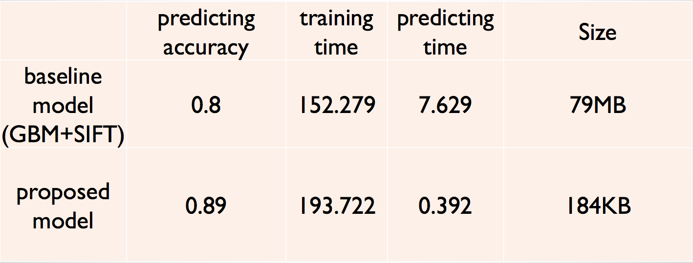

# Project: Dogs, Fried Chicken or Blueberry Muffins?


### [Full Project Description](doc/project3_desc.md)

Term: Fall 2017

+ Team #3
+ Team members
	+ Chaoyue Tan
    + Han Lin 
    + Hongyang Yang
    + Peilin Qiu
    + Wyatt Thompson


+ Project summary: In this project, we created a classification engine for images of dogs versus fried chicken versus blueberry muffins. ([Main.Rmd](doc/main.Rmd))
+ Project details: First, we researched on several classification medels including gbm, xgboost, random forest, logistic regression, lasso, nueral network, svm and cnn. Next, we test different ways of feature extraction including sift, hog, pca, lbp and cnn and use the features we got to work with different models. Finally, we found the most efficient solution of this problem is using model xgboost and feature sift+hog+lbp+gray256.

+ Quick Access: In case you get lost in the main file, this folder contains everything you need to run the advanced model ([Final_model](lib/Hongyang_Final))

### Be Careful about the order of the features: SIFT(5000)+HOG(448)+LBP(59)+Gray(256)



	



**Contribution statement**: ([default](doc/a_note_on_contributions.md)) All team members approve our work presented in this GitHub repository including this contributions statement. 

## Peilin: 

Designed SIFT with PCA as feature extraction. Tried to develop CNN feature extraction together with Chaoyue. Carried out the Lasso and Random Forests model and tested them on various features. Helped finish the final report.

## Chaoyue: 

Carried out the model of Logistic Regression and tested it on various features. Researched on feature extraction method CNN and tried to develop CNN feature extraction on this problem together with Peilin. Helped finish the final report.

## Han Lin: 

Wrote final files:

* Wrote main.Rmd, train.R, test.R, feature.R, cross_validation.R and presentation file.

Feature Extraction:

* Wrote function to extract 448-dim HOF feature from raw images.

Model:

* Implemented baseline model (GBM with provided SIFT feature), got accuracy 80%.

* Implemented GBM model, wrote function to train, test, cross validation, tune parameters.

* Implemented XGB model, wrote function to train, test, cross validation, tune parameters.

Test:

* Tried GBM and XGB on different combination of features (HOG,SIFT+HOG,SIFT+HOG+LBP,SIFT+HOG+LBP+Gray256).

* Got final combination of model and feature: XGB with SIFT+HOG+LBP+Gray256, accuracy 89%


## Hongyang Yang:

Feature Extraction: 
1. extract gray raw image features (320,000) and divide into 256 quantiles and count the frequency, use frequency/320000, so we have 256 unique features for each image.
2. use matlab extract LBP features from raw image, 59 features

Model:
1. Wrote Neural network model, run HOG+LBP feautres, get 0.82 accuracy rate
2. Wrote CNN model, run 28 by 28 pixels raw features, and get 0.52 accuracy rate. (took 3 hours to run for 128*128 raw features and finnaly crash!!!)

Test:
1. Tried different features combination (LBP+ HOG, LBP+HOG+Gray, SIFT+LBP+HOT, SIFT after PCA + HOG + LBP, SIFT+HOT+LBP+Gray256) on every model (gbm, xgboost, random forest, neural network)
2. Finally summarized that feature combination: SIFT+HOT+LBP+Gray256 has the best test accuracy (0.88777 after 5-fold cv on the entire data). 


## Wyatt Thompson
Examined the model of Support Vector Machine with varying kernels and tuned parameters. Researched the general problem of image classification in order to plan. 

Following [suggestions](http://nicercode.github.io/blog/2013-04-05-projects/) by [RICH FITZJOHN](http://nicercode.github.io/about/#Team) (@richfitz). This folder is orgarnized as follows.

```
proj/
├── lib/
├── data/
├── doc/
├── figs/
└── output/
```

Please see each subfolder for a README file.
